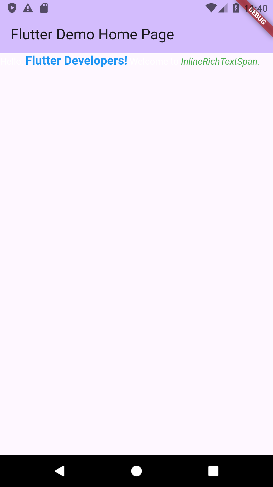

# Inline RichText Span

This package provides `InlineRichTextSpanWidget`, a convenient wrapper around Flutter's `RichText` widget. It's designed to make constructing complex text layouts with multiple styles more straightforward by accepting `InlineSpan`s directly in its `children` list.

## Features

*   **Simplified API:** Directly pass a `List<InlineSpan>` to the `children` property.
*   **Familiar Properties:** Inherits most properties from the standard `RichText` widget (e.g., `textAlign`, `textDirection`, `softWrap`, `overflow`, `maxLines`, etc.).
*   **Easy Styling:** Construct text with various styles, sizes, weights, and colors seamlessly.
*   **Gesture Recognition:** Supports `TextSpan`s with `GestureRecognizer`s for interactive text.

## Getting Started

### Installation

1.  Add this to your package's `pubspec.yaml` file:

```yaml
dependencies:
  inline_rich_text_span: version
```

2.  Or install it by running the following command in your project's root directory:

```yaml
flutter pub add inline_rich_text_span
```
3. Now, import the package in your Dart code:

```dart
import 'package:inline_rich_text_span/inline_rich_text_span.dart';
```


## Usage

`InlineRichTextSpanWidget` is built and returns the standard `RichText` widget, but you provide `InlineSpan` children directly.

### Basic Example

```dart
import 'package:flutter/material.dart';
import 'package:inline_rich_text_span/inline_rich_text_span.dart';

class MyTextWidget extends StatelessWidget {
  const MyTextWidget({super.key});

  @override
  Widget build(BuildContext context) {
    return const InlineRichTextSpanWidget(
      children: [
        TextSpan(text: 'Hello, '),
        TextSpan(
          text: 'Flutter Developers!',
          style: TextStyle(
            fontWeight: FontWeight.bold,
            color: Colors.blue,
            fontSize: 18,
          ),
        ),
        TextSpan(text: ' Welcome to '),
        TextSpan(
          text: 'InlineRichTextSpan.',
          style: TextStyle(fontStyle: FontStyle.italic, color: Colors.green),
        ),
      ],
      textAlign: TextAlign.center,
    );
  }
}
```

produces:



### Example with Interactive Text (Tap Gesture)

```dart
import 'package:flutter/gestures.dart';
import 'package:flutter/material.dart';
import 'package:inline_rich_text_span/inline_rich_text_span.dart';

class InteractiveTextExample extends StatefulWidget {
  const InteractiveTextExample({super.key});

  @override
  State<InteractiveTextExample> createState() => _InteractiveTextExampleState();
}

class _InteractiveTextExampleState extends State<InteractiveTextExample> {
  String _message = "Tap on 'Clickable'.";
  late TapGestureRecognizer _tapRecognizer;

  @override
  void initState() {
    super.initState();
    _tapRecognizer =
        TapGestureRecognizer()
          ..onTap = () {
            setState(() {
              _message = "'Clickable' was tapped!";
            });
            // Remember to dispose of the recognizer if it's part of a stateful widget
            // and the widget is removed from the tree, or if you re-create it.
            // However, for TextSpans, Flutter's RichText handles this.
            // If you were creating it outside a TextSpan, you'd manage its lifecycle.
          };
  }

  @override
  void dispose() {
    _tapRecognizer.dispose();
    // Important to dispose of recognizers
    super.dispose();
  }

  @override
  Widget build(BuildContext context) {
    return Column(
      mainAxisAlignment: MainAxisAlignment.center,
      children: [
        InlineRichTextSpanWidget(
          children: [
            const TextSpan(text: 'This is some text. '),
            TextSpan(
              text: 'Clickable',
              style: const TextStyle(
                color: Colors.purple,
                decoration: TextDecoration.underline,
                fontWeight: FontWeight.bold,
              ),
              recognizer: _tapRecognizer,
            ),
            const TextSpan(text: ' and some more normal text.'),
          ],
        ),
        const SizedBox(height: 20),
        Text(_message),
      ],
    );
  }
}
```

result:


### License

This package is licensed under the `MIT License` - see the [LICENSE](LICENSE) file for details.
